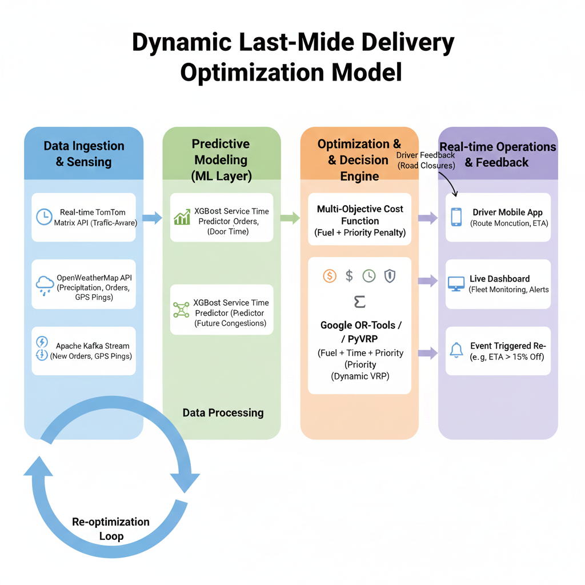

# Tech4u_Neuronova

# Project Charter: Intelligent Last-Mile Delivery Optimization (DLMO)

## 1. Project Overview

**Objective:** To develop a dynamic, city-intelligent routing engine that minimizes fuel consumption and delivery time by navigating the "chaos" of urban environments (traffic, weather, and shifting priorities).

## 2. The Unique Value Proposition

Unlike static routing software, this solution uses a **Predictive-Reactive Hybrid Architecture**. It doesn't just plan a route; it manages a live ecosystem by predicting "hidden" time sinks like parking difficulty and traffic ripple effects.

---

## 3. Technical Architecture

The system is divided into three functional layers:

### A. The Perception Layer (Data Ingest)

- **Traffic Intelligence:** TomTom Matrix Routing v2 API (Live Traffic mode).
- **Environmental Sensing:** OpenWeatherMap API for precipitation-based speed scaling.
- **Stream Processing:** Apache Kafka for real-time GPS and new order ingestion.

### B. The Intelligence Layer (ML Models)

- **Service Time Predictor (XGBoost):** Forecasts dwell time (parking + walking) based on building density and time of day.
- **Cost Function ($C$):** $$C = w_1(\text{Fuel}) + w_2(\text{Time}) + w_3(\text{Priority Penalty})$$

### C. The Decision Layer (Optimization)

- **Core Solver:** Google OR-Tools / PyVRP.
- **Logic:** Employs Meta-heuristics (Tabu Search/Simulated Annealing) to solve the Vehicle Routing Problem (VRP).

---

## 4. Implementation Roadmap

### Phase 1: Data Infrastructure

- Integration of TomTom API for dynamic $N \times N$ matrix calculation.
- Setup of PostGIS database for geospatial storage.

### Phase 2: Predictive Development

- Training XGBoost models on historical delivery data.
- Creating the "Weather-Traffic" scalar for edge-weight adjustment.

### Phase 3: Solver Configuration

- Programming constraints: Vehicle capacity, driver shifts, and customer time windows.
- Implementing "Penalty Weights" for high-priority tiers.

### Phase 4: Reactive Logic

- Designing "Chaos Triggers" (e.g., re-optimize if ETA variance > 15%).
- Building the FastAPI gateway for mobile app communication.

---

## 5. Technology Stack

| Category             | Tool / Framework               |
| :------------------- | :----------------------------- |
| **Language**         | Python 3.10+                   |
| **Optimization**     | Google OR-Tools, PyVRP         |
| **Machine Learning** | XGBoost, Scikit-learn, BentoML |
| **Geospatial**       | PostGIS, GeoPandas, OSMnx      |
| **Data Flow**        | FastAPI, Apache Kafka, Redis   |

---

## 6. Economic Benefits & ROI

- **Fuel Savings:** Projected 15–25% reduction.
- **Labor Efficiency:** 20% increase in stops-per-hour.
- **Customer Trust:** Real-time, high-accuracy ETAs with < 5% variance.
- **Sustainability:** Direct reduction in CO2 footprint through minimized idling.

---

## 7. Potential Challenges & Mitigations

- **API Costs:** Mitigated by "Triggered" re-optimization rather than constant polling.
- **GPS Drift:** Mitigated by Hidden Markov Model (HMM) map-matching.
- **Driver Trust:** Mitigated by territory clustering and intuitive UX.
